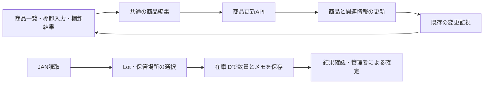

# 操作性と保守の設計方針

## 目的と判断基準

この変更は、棚卸と商品管理の「続きを探す・対象を特定する・入力を保存する・結果を確認する」を改善する。新しい画面を増やすことより、既存画面が同じ規則で動くことを優先する。

| 観点 | 今回の実装 | 確認方法 |
| --- | --- | --- |
| 探しやすさ | ホームに自分の途中の棚卸、一覧に状態・複数語の検索 | ホーム、状態切替、全角検索の操作 |
| 情報量 | 商品・棚卸一覧と結果を30件ずつ描画 | 5,000件の検証データで末尾の商品まで検索 |
| 一貫性 | 商品一覧も共通の商品編集を使用 | 入力規則・変更理由・更新日時による競合検出を共通化 |
| 誤操作への配慮 | 未保存の商品編集を閉じる際の確認 | 破棄を断ると入力を保持 |
| 操作位置 | 共通のネイティブダイアログ | Tab、Escape、閉じた後のフォーカス復帰 |
| 非同期処理 | 商品一覧の古い失敗応答で最新の表示を消さない | 古い応答を遅らせるブラウザ検証 |
| 結果確認 | メモ・差異・商品・Lot・場所で絞り込み | 複合条件から正しい商品の編集へ |

## 共通部品

- `ProductEditDialog`：商品共通情報の編集。商品一覧、棚卸入力、棚卸結果で使用。Lot別の数量・期限等は在庫詳細の責務。
- `Modal`：ダイアログのフォーカス保持・Escape・復帰。保存中は閉じる操作を無効化。呼び出し側が未保存変更の破棄可否を判断。
- `usePagedItems` / `Pagination`：検索条件変更で先頭へ、通常の更新ではページを保持、件数減少時は有効な最終ページへ。表示範囲と総件数を分ける。
- `SearchBar` / `matchesSessionSearch`：検索欄の操作名、クリア、全角英数字、複数語検索を共通化。
- `StocktakeGroupFilter`：既存の状態区分を継続利用。
- `ContinueStocktake`：ホーム上の「自分の作業」。権限のある利用者に表示し、取得失敗を棚卸が0件であることと混同しない。

商品一覧の子コンポーネントは再度ユーザー情報を取りに行かず、親から表示権限を受け取る。実際の書込権限は従来どおりAPI側で確認する。表示制御だけを権限検証にしてはいけない。

## データの識別

| 情報 | 識別と責務 |
| --- | --- |
| JAN | 商品を探すコード。同じJANから複数の在庫・Lotが見つかるのは正常 |
| 商品ID | 商品名・分類・標準単位等の共通情報を編集するID |
| 管理No. | 既存の `InventoryInstance.id`。在庫・Lot単位の保存先を特定 |
| 基準数量 | `StocktakeTarget.expectedQuantity`。棚卸の比較対象 |
| 入力数量・メモ | `StocktakeRecord`。棚卸の記録 |
| 在庫確定 | 既存の確定API。権限・セッション状態・競合を検査して反映 |

## 拡張するとき

一覧を増やす場合は検索とページ分割を同じ部品で組み立てる。商品共通項目を増やす場合は共通編集とAPIの入力検証・関連情報更新を一緒に変更する。画面だけに別の更新処理を作らない。

一括処理の対象は画面上に明示する。現在の商品一覧では「検索結果の全件」が全選択の対象で、ページ移動しても選択を保持する。検索条件で対象が外れた商品は選択から外れる。印刷ボタンにも件数を表示する。

通信エラーと、取得成功した0件は別の状態として扱う。データを取得し直す際、以前の表示を残せる画面では残す。サーバー側の競合検査を省略して、古い表示を無条件に書き戻してはいけない。

## 検証と残る範囲

この変更のブラウザ確認は、実際のReact画面部品に検証用API応答を与えたもの。本番DB・ネットワーク・端末の負荷を再現したE2E試験ではない。スマートフォン幅の表示確認はデスクトップChromeの390px幅で行っている。

前端の描画件数は制限したが、既存APIは一覧全体を取得する。大量データ・多数端末での通信量やDB負荷を抑えるには、サーバー側検索・ページ分割・索引・更新通知の設計と実測が別途必要。約1秒間隔の監視は継続し、通信時間ゼロや接続断中の他端末反映は保証しない。

Pixel 9 ProのPWA追加不可は実機で原因を特定していない。規格準拠の認証、全画面のアクセシビリティ監査、侵入テスト、実機カメラ・プリンタ・多数端末の負荷試験を完了したものではない。
